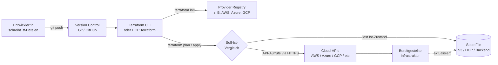

Thema: Terraform 
Autor: Patrick Menghini 

## 1. Überblick

Terraform ist ein Open-Source-Tool für Infrastructure as Code (IaC), welches 2014 von der HashiCorp entwickelt und veröffentlicht wurde. Es provisioniert IT-Infrastruktur – von einer einzelnen virtuellen Maschine bis hin zu kompletten Multi-Cloud-Landschaft – nicht mehr „per Mausklick" (ClickOps) über eine Web-Oberfläche eines Cloud-Anbieters sondern als Konfigurationsdateien zu beschreiben. In Git zu versionieren und automatisiert auszurollen.

Vereinfacht gesagt: Statt X Klicks in der AWS-Konsole schreibt man einige Zeilen Code, lässt diesen in einem Pull Request reviewen und triggert anschließend dann das Deployment bzw Pipeine an. 

Terraform legt die Ressourcen On-Prem oder beim jeweiligen Cloudanbieter an, ändert sie oder baut sie wieder ab. Der versionierte Code wird somit zur Single Source of Truth!

Was im Repository steht, ist auch das, was auf VMware oder in der Cloud provisioniert worden ist und läuft.

Terraform arbeitet deklarativ und zustandsorientiert. Der Admin beschreibt nicht wie die Infrastruktur erzeugt werden soll, sondern wie sie aussehen soll.

Terraform ist laut der CNCF Annual Survey 2024 mit rund 76 % Marktanteil das mit Abstand verbreitetste IaC-Werkzeug.

Seit Februar 2025 gehört HashiCorp zum IBM-Konzern.

---

## 2. In welchem Kontext wird Terraform verwendet?

Terraform ist eines der zentralen Werkzeuge im DevOps- und Platform-Engineering Umfeld. Es löst ein Problem, das mit dem Aufkommen der Cloud entstanden ist. Nämlich Cloud-Ressourcen sind kurzlebig, vielfältig und können in Minuten skaliert werden – manuelle Administration über GUIs ist dadurch fehleranfällig, schlecht reproduzierbar und kaum auditierbar („Click-Ops" gilt als Anti-Pattern).

Infrastructure as Code überträgt die etablierten Prinzipien der Softwareentwicklung auf die Verwaltung von Infrastruktur:

- **Reproduzierbarkeit** – eine identische Test- oder z.B DR-Umgebung lässt sich mit Code erzeugen.
- **Versionierung** – jede Änderung liegt in Git, ist nachvollziehbar und reversibel.
- **Skalierbarkeit** – ob ein oder hundert Server provisioniert werden, ist egal , ist nur mehr eine Variable.
- **Kollaboration** – Reviews per Pull Request statt Tickets an einen Admin.
- **Compliance** – Richtlinien lassen sich automatisiert als „Policy as Code" prüfen.

Typische Einsatzfelder sind Cloud-Provisioning (AWS, Azure, GCP), Hybrid- und Multi-Cloud-Szenarien, On-Premises-Virtualisierung (vSphere, OpenStack) sowie die Konfiguration von SaaS-Diensten (GitHub-Organisationen, Datadog-Monitore, Cloudflare-DNS).

---

### Architekturdiagramm

### Kernkonzepte

- **HCL (HashiCorp Configuration Language).** JSON-ähnliche Konfigurationssprache mit der Endung `.tf`. Optional kann auch reines JSON verwendet werden.
- **Provider.** Plugins, die die API eines konkreten Anbieters (AWS, Azure, GCP, GitHub, Cloudflare, Kubernetes …) für Terraform übersetzen. In der **Terraform Registry** stehen über 3.000 offizielle und Community-Provider zur Verfügung. Die Kommunikation zwischen Terraform Core und Provider erfolgt über **gRPC**, die Provider selbst sprechen die jeweiligen **REST-/HTTPS-APIs** der Anbieter.
- **Resource.** Die kleinste verwaltbare Einheit – etwa `aws_instance`, `azurerm_storage_account` oder `kubernetes_deployment`.
- **State File (`terraform.tfstate`).** Eine JSON-Datei, in der Terraform sich merkt, welche Ressourcen es real angelegt hat. Sie ist das Bindeglied zwischen Soll-Zustand (Code) und Ist-Zustand (Cloud). In Teams wird sie typischerweise in einem **Remote Backend** (S3 + DynamoDB-Locking, Azure Blob Storage, HCP Terraform) zentral abgelegt.
- **Module.** Wiederverwendbare Pakete aus mehreren `.tf`-Dateien – vergleichbar mit Bibliotheken in der Softwareentwicklung. Sie ermöglichen Standardisierung und das DRY-Prinzip („Don't Repeat Yourself").
- **Plan & Apply.** Terraform vergleicht Soll- und Ist-Zustand und erzeugt einen **Execution Plan**, also eine vollständige Vorschau, welche Ressourcen erstellt, geändert oder zerstört würden. Erst nach Freigabe wird er ausgeführt.

### Workflow

1. **Write** – Konfiguration in `.tf`-Dateien schreiben
2. `terraform init` – Provider und Module herunterladen, Backend initialisieren
3. `terraform plan` – Vorschau der geplanten Änderungen
4. `terraform apply` – Änderungen tatsächlich durchführen
5. `terraform destroy` – Optional: alle verwalteten Ressourcen wieder abbauen

Wichtig: Terraform-Operationen sind **idempotent** – ein wiederholter `apply` ohne Code-Änderung erzeugt keine Änderungen an der Infrastruktur.

---

## 7. Lizenzwechsel und Fork

Im August 2023 stellte HashiCorp Terraform überraschend von der freien Mozilla Public License (MPL 2.0) auf die quellverfügbare, aber nicht mehr OSI-konforme Business Source License (BSL 1.1)** um. Die kommerzielle Nutzung gegen HashiCorp-eigene Produkte wurde dadurch rechtlich riskant.

Die Reaktion der Community kam binnen Tagen: Firmen wie **Gruntwork, Spacelift, env0 und Harness** forkten den letzten MPL-Stand von Terraform 1.5 und gründeten unter dem Dach der **Linux Foundation** das Projekt **OpenTofu**, das inzwischen als CNCF-Sandbox-Projekt geführt wird. OpenTofu ist nahezu vollständig befehls- und konfigurationskompatibel; ein Wechsel ist meist nur ein Ersetzen von `terraform` durch `tofu` im CI-Skript.

Im Februar 2025 hat IBM HashiCorp übernommen (rund 6,4 Mrd. USD), was die langfristige Roadmap und die Lizenzfrage zusätzlich politisch auflädt. Für das Erlernen der Technologie spielt das aber keine große Rolle: **Konzepte, HCL-Syntax und Workflow sind in beiden Welten identisch.

---

## 8. Reale Anwendungsbeispiele

- **Multi-Cloud-Setup.** Eine Firma betreibt ihre Applikation auf AWS, Logging auf GCP und das CDN über Cloudflare – ein einziges Terraform-Repository provisioniert alle drei Stacks.
- **Ephemerale Test-Umgebungen.** Pro Pull Request wird automatisch eine vollständige Staging-Umgebung gestartet und nach dem Merge wieder zerstört.
- **Platform Engineering.** Interne Plattform-Teams stellen Entwicklerinnen wiederverwendbare Terraform-Module bereit („Golden Paths" für Self-Service).
- **Disaster Recovery.** Eine komplette Cloud-Region lässt sich in Minuten in einer anderen Region neu aufsetzen – Voraussetzung ist nur ein aktuelles State-Backup.
- **Compliance & Governance.** Policy-as-Code mit Sentinel, OPA oder Checkov prüft jeden `plan` automatisch auf Verstöße (z. B. „keine öffentlich erreichbaren S3-Buckets", „keine Ressourcen ohne Cost-Center-Tag").

---

## Quellen

1. HashiCorp – *What is Terraform*: <https://developer.hashicorp.com/terraform/intro>
2. HashiCorp – *What is Infrastructure as Code with Terraform*: <https://developer.hashicorp.com/terraform/tutorials/aws-get-started/infrastructure-as-code>
3. Wikipedia – *Terraform (software)*: <https://en.wikipedia.org/wiki/Terraform_(software)>
4. OpenTofu – *OpenTofu Announces Fork of Terraform*: <https://opentofu.org/blog/opentofu-announces-fork-of-terraform/>
5. Spacelift – *Terraform License Change (BSL) – Impact on Users & Providers*: <https://spacelift.io/blog/terraform-license-change>
6. Scalr – *What is OpenTofu? The Open-Source Terraform Fork*: <https://scalr.com/learning-center/what-is-opentofu>
7. Microsoft Azure – *Infrastructure as Code – HashiCorp Terraform*: <https://azure.microsoft.com/en-us/solutions/devops/terraform>
