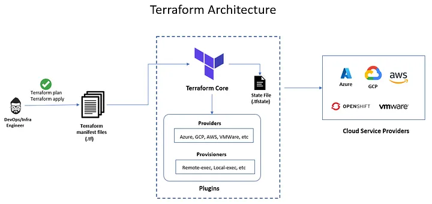
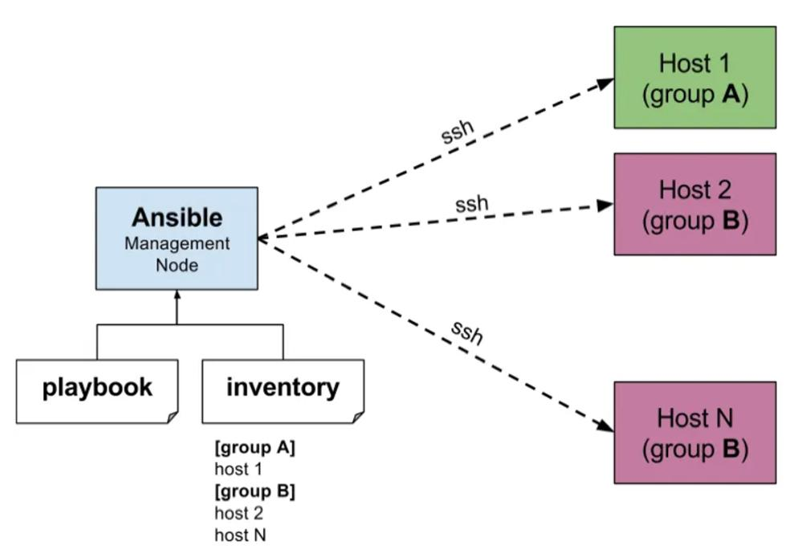

# Infrastructure as Code (IaC)

## 1. Einführung

Infrastructure as Code (IaC) beschreibt einen modernen Ansatz zur Verwaltung und Bereitstellung von IT-Infrastruktur. Dabei wird Infrastruktur, wie Server, Netzwerke, Datenbanken oder komplette Cloud-Umgebungen, nicht mehr manuell eingerichtet, sondern durch Code definiert und automatisiert bereitgestellt.

Früher wurden Systeme oft manuell konfiguriert, was zeitaufwendig und fehleranfällig war. Mit IaC wird dieser Prozess standardisiert und reproduzierbar gemacht. Infrastruktur wird dabei ähnlich behandelt wie Software: Sie kann versioniert, getestet und automatisiert ausgerollt werden.

Das Ziel von IaC ist es, IT-Systeme effizienter, skalierbarer und zuverlässiger zu betreiben.

---

## 2. Kontext und Einsatzgebiete

Infrastructure as Code wird hauptsächlich im Umfeld moderner Softwareentwicklung und IT-Betriebsmodelle eingesetzt. Besonders relevant ist IaC in folgenden Bereichen:

- Cloud Computing
- DevOps
- Continuous Integration und Continuous Deployment (CI/CD)
- Microservices-Architekturen
- Container-Plattformen

Ein zentrales Problem, das IaC löst, ist der sogenannte "Konfigurationsdrift". Dabei unterscheiden sich Systeme, obwohl sie eigentlich identisch sein sollten. Mit IaC kann sichergestellt werden, dass Entwicklungs-, Test- und Produktionsumgebungen exakt gleich aufgebaut sind.

Typische Anwendungsfälle sind:

- Automatisierte Bereitstellung neuer Server
- Schnelles Skalieren von Anwendungen bei steigender Last
- Wiederherstellung von Systemen nach Ausfällen
- Aufbau kompletter Infrastruktur auf Knopfdruck

IaC ist somit ein wichtiger Bestandteil moderner DevOps-Strategien, da es die Zusammenarbeit zwischen Entwicklung und Betrieb verbessert.

---

## 3. Technische Funktionsweise

Die technische Grundlage von IaC besteht darin, dass der gewünschte Zustand einer Infrastruktur in Form von Code beschrieben wird. Dieser Code wird anschließend von speziellen Tools interpretiert und umgesetzt.

Grundsätzlich gibt es zwei Ansätze:

### Deklarativer Ansatz

Beim deklarativen Ansatz wird beschrieben, wie der Zielzustand aussehen soll. Das System entscheidet selbst, welche Schritte notwendig sind, um diesen Zustand zu erreichen.

### Imperativer Ansatz

Hier wird Schritt für Schritt definiert, wie die Infrastruktur aufgebaut werden soll. Dieser Ansatz ist weniger flexibel, da Änderungen oft manuell angepasst werden müssen.

In der Praxis setzen viele moderne Tools auf den deklarativen Ansatz, da dieser einfacher zu verwalten ist.

Der typische Ablauf sieht wie folgt aus:

1. Erstellung der Infrastrukturdefinition in einer Datei
2. Speicherung im Versionskontrollsystem (z.B. Git)
3. Ausführung durch ein IaC-Tool
4. Vergleich zwischen Ist- und Soll-Zustand
5. Automatische Anpassung der Infrastruktur

Dadurch wird sichergestellt, dass die reale Infrastruktur immer dem definierten Zustand entspricht.

---

## 4. Architektur und Prinzipien

Die Architektur von IaC basiert auf einer klaren Trennung zwischen Definition und Ausführung. Entwickler definieren die Infrastruktur in Codeform, während spezialisierte Tools die Umsetzung übernehmen.

Wichtige Prinzipien sind:

- **Idempotenz**: Mehrfaches Ausführen führt immer zum gleichen Ergebnis
- **Versionierung**: Änderungen können nachvollzogen werden
- **Automatisierung**: Minimierung manueller Eingriffe
- **Reproduzierbarkeit**: Identische Umgebungen können beliebig oft erstellt werden

Diese Prinzipien machen IaC besonders wertvoll in komplexen IT-Landschaften.

---

## 5. Tools, Technologien und Hersteller

Es gibt eine Vielzahl von Tools, die Infrastructure as Code unterstützen. Zu den bekanntesten gehören:

- Terraform: Ein weit verbreitetes Tool zur Verwaltung von Multi-Cloud-Infrastrukturen
- AWS CloudFormation: Native Lösung für Amazon Web Services
- Ansible: Tool zur Automatisierung und Konfigurationsverwaltung
- Pulumi: Ermöglicht IaC mit klassischen Programmiersprachen
- Chef und Puppet: Tools für Konfigurationsmanagement

Zu den wichtigsten Cloud-Anbietern gehören:

- Amazon Web Services (AWS)
- Microsoft Azure
- Google Cloud Platform

Diese Plattformen bieten oft eigene IaC-Lösungen oder Schnittstellen zu bestehenden Tools.

---

## 6. Vorteile

Infrastructure as Code bietet zahlreiche Vorteile:

- Reduktion menschlicher Fehler durch Automatisierung
- Schnellere Bereitstellung von Infrastruktur
- Einheitliche und konsistente Umgebungen
- Bessere Zusammenarbeit zwischen Teams
- Nachvollziehbarkeit durch Versionskontrolle

Besonders in dynamischen Umgebungen mit häufigen Änderungen ist IaC ein entscheidender Wettbewerbsvorteil.

---

## 7. Herausforderungen

Trotz der Vorteile bringt IaC auch einige Herausforderungen mit sich:

- Einarbeitung in neue Tools und Technologien
- Komplexität bei großen Infrastrukturen
- Fehler im Code können weitreichende Auswirkungen haben
- Sicherheitsaspekte müssen berücksichtigt werden

Eine sorgfältige Planung und gute Dokumentation sind daher entscheidend.

---

## 8. Praxisbeispiele

In der Praxis wird IaC in vielen Szenarien eingesetzt:

- Startups nutzen IaC, um schnell skalierbare Cloud-Infrastrukturen aufzubauen
- Große Unternehmen automatisieren komplette Rechenzentren
- DevOps-Teams erstellen und verwalten Umgebungen automatisch
- Container-Plattformen werden dynamisch bereitgestellt

Diese Beispiele zeigen, dass IaC sowohl für kleine als auch große Systeme geeignet ist.

### AWS EC2 Instanz mit Terraform
```hcl
provider "aws" {
  region = "eu-central-1"
}

resource "aws_instance" "web_server" {
  ami           = "ami-12345678"
  instance_type = "t2.micro"

  tags = {
    Name = "IaC-WebServer"
  }
}
```



*Abbildung 1: Übersicht über die Architektur von Terraform.*

### Nginx web server mit Ansible
```yaml
- name: Install and start Nginx web server
  hosts: webservers
  become: yes

  tasks:
    - name: Install Nginx
      apt:
        name: nginx
        state: present
        update_cache: yes

    - name: Start Nginx service
      service:
        name: nginx
        state: started
        enabled: yes
```



*Abbildung 2: Übersicht über die Architektur von Ansible.*

---

## 9. Fazit

Infrastructure as Code ist ein zentraler Bestandteil moderner IT-Infrastrukturen. Durch die Automatisierung und Standardisierung von Prozessen ermöglicht IaC eine effizientere Verwaltung von Systemen.

Die Fähigkeit, Infrastruktur wie Software zu behandeln, bietet enorme Vorteile in Bezug auf Geschwindigkeit, Skalierbarkeit und Zuverlässigkeit. Trotz einiger Herausforderungen ist IaC heute aus der Cloud- und DevOps-Welt nicht mehr wegzudenken.

---

## 10. Quellen

- https://www.hashicorp.com/resources/what-is-infrastructure-as-code
- https://aws.amazon.com/what-is/iac/
- https://learn.microsoft.com/en-us/devops/deliver/what-is-infrastructure-as-code
- https://www.redhat.com/en/topics/automation/what-is-infrastructure-as-code-iac
- https://www.atlassian.com/microservices/cloud-computing/infrastructure-as-code
- https://www.redhat.com/de/topics/automation/learning-ansible-tutorial
- https://docs.ansible.com/
- https://developer.hashicorp.com/terraform/docs

## 11. Abbildungsverzeichnis
- Abbildung 1: https://alvinrajan.medium.com/automated-infrastructure-through-terraform-1a2b3159ce96
- Abbildung 2: https://medium.com/%40suryapraneeth5/ansible-day-1-introduction-5e48909fa854