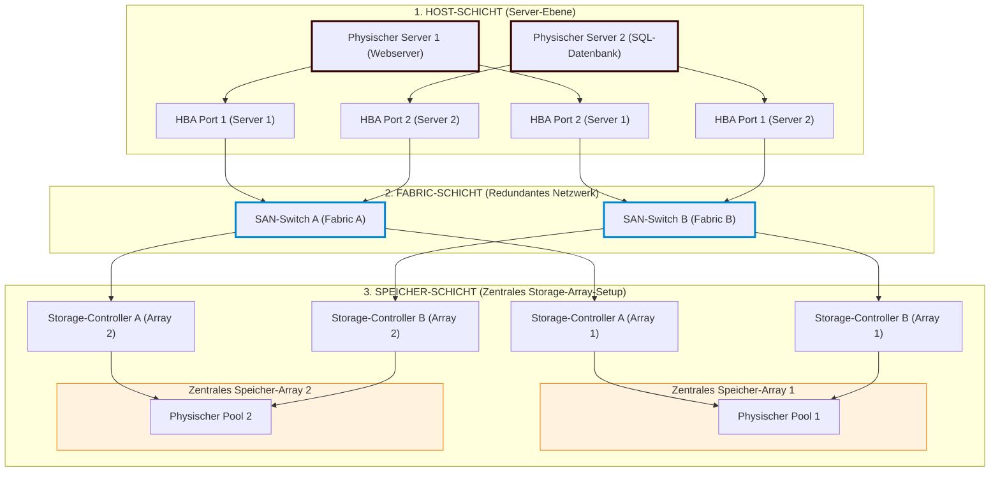

# Storage Area Network (SAN) - Ausarbeitung von Albert Reinberg-Leibel

## Was ist SAN?

Ein Storage Area Network (SAN) bezeichnet ein eigenständiges, vom regulären lokalen Netzwerk (LAN) isoliertes Speichernetzwerk. Seine primäre Aufgabe besteht darin, Server-Systeme mit zentralen Speichermedien wie Disk-Arrays, SSD-Arrays oder Tape-Libraries zu verbinden. Der wesentliche technologische Unterschied zu herkömmlichen Netzwerkspeichern liegt im blockbasierten Zugriff (Block-Level Storage). Das bedeutet, dass Daten nicht als fertige Dateien, sondern in Form von rohen Datenblöcken übertragen werden.
Aus Sicht des angeschlossenen Betriebssystems verhält sich dieser Speicherplatz exakt wie eine lokal eingebaute Festplatte. Das Dateisystem wird dementsprechend direkt vom Server selbst verwaltet, was den Protokoll-Overhead minimiert und eine sehr effiziente, latenzarme Datenübertragung ermöglicht.

---

## Unterschiede zu DAS und NAS

Um die Einordnung eines SANs zu leichter verständlich zu machen, hilft der direkte Vergleich mit Direct Attached Storage (DAS) und Network Attached Storage (NAS). 
DAS ist genauso wie SAN Block Storage, basiert aber auf einer reinen Punkt-zu-Punkt-Verbindung und ist direkt mit dem jeweiligen Server verbunden. NAS ist im Gegensatz dazu File-basiert und arbeitet über das normale LAN. 

**Die folgende Tabelle stellt die wichtigsten Unterschiede übersichtlich dar:**

| Kriterien | Direct Attached Storage (DAS) | Network Attached Storage (NAS) | Storage Area Network (SAN) |
| :--- | :--- | :--- | :--- |
| **Zugriffsebene** | Blockebene (lokal) | Dateiebene (File-Level) | Blockebene (netzwerkbasiert) |
| **Kommunikation über** | direktes Kabel (Punkt zu Punkt) | Gemeinsames LAN (TCP/IP) | Dediziertes Speichernetzwerk |
| **Protokolle** | SAS, SATA, NVMe | NFS, SMB/CIFS | Fibre Channel, iSCSI, FC-NVMe, FCIP |
| **Dateisystem** | Auf dem Host-Server | Auf dem NAS-Gerät selbst | Auf dem Host-Server |
| **Skalierbarkeit** | Stark limitiert | Gut (einfaches Hinzufügen) | Nahezu unbegrenzt flexibel |

---

## Anwendungsbereiche

Im professionellen IT-Betrieb und in modernen Rechenzentren kommen SAN-Infrastrukturen vor allem dort zum Einsatz, wo hohe Verfügbarkeit und Performance zwingend erforderlich sind.
Ein typisches Szenario ist die Server-Virtualisierung. Große Cluster-Umgebungen benötigen Speicherlösungen, auf die mehrere physische Server gleichzeitig zugreifen können. Erst diese gemeinsame Speicherbasis ermöglicht Funktionen wie die Live-Migration von virtuellen Maschinen, bei denen Systeme im laufenden Betrieb ohne Unterbrechung zwischen physischen Hosts verschoben werden können.
Ein weiteres zentrales Einsatzgebiet sind große, transaktionsintensive Datenbanksysteme. Da der Speicherverkehr physisch vom normalen Benutzer- und Client-Verkehr getrennt ist, bleiben die Latenzzeiten minimal und vorhersehbar. Zudem erleichtern solche Architekturen die Umsetzung von Disaster-Recovery-Strategien, da Datenblöcke direkt zwischen Speichersystemen gespiegelt oder effiziente, netzwerkunabhängige Backups durchgeführt werden können.

---

## Physischer Aufbau (Schichtenmodell)

Die physische Architektur eines SANs lässt sich klassisch in drei Schichten unterteilen:

*  **Die Host-Schicht:** Sie umfasst die Server-Systeme, die über spezielle Erweiterungskarten, sogenannte Host-Bus-Adapter (HBA), an das Speichernetzwerk angebunden sind. Diese Karten übernehmen die hardwareseitige Verarbeitung der Speicherbefehle und entlasten die Server-CPU.
*  **Die Fabric-Schicht:** Sie bildet den Kern des Netzwerks und besteht aus Hochgeschwindigkeitsverkabelung sowie dedizierten SAN-Switches. Um Ausfälle abzufangen, wird diese Infrastruktur in produktiven Umgebungen grundsätzlich redundant als zwei komplett voneinander isolierte Netzwerke (Fabric A und Fabric B) aufgebaut.
*  **Die Speicher-Schicht:** Auf dieser Ebene befinden sich die eigentlichen Speicher-Arrays mit ihren Controllern und den physischen Datenträgern, die zu logischen Einheiten zusammengefasst werden.

---

## Relevante SAN-Protokolle im Vergleich

Für die Übertragung der Datenblöcke zwischen Hosts und Speichersystemen kommen unterschiedliche Protokolle zum Einsatz, die sich je nach Anforderungen an Performance, Kosten und Infrastruktur unterscheiden:

*  **Fibre Channel Protocol (FCP):** Dies ist die am häufigsten eingesetzte Option und stellt den klassischen Standard für SANs dar. Es handelt sich um ein dediziertes Fibre-Channel-Transportprotokoll, in das standardisierte SCSI-Befehle direkt eingebettet sind. Es arbeitet extrem latenzarm und garantiert einen verlustfreien Datentransport.
*  **Internet Small Computer System Interface (iSCSI):** Hierbei handelt es sich um ein IP-basiertes Protokoll, das SCSI-Befehle in herkömmliche Ethernet-Frames kapselt und IP-Ethernet für den Transport nutzt. Der Vorteil liegt in den geringeren Infrastrukturkosten, da Standard-Netzwerkhardware verwendet werden kann.
*  **NVMe over Fibre Channel (FC-NVMe):** Ein modernes Protokoll, das speziell für den Zugriff auf schnellen Flash-Speicher (SSDs) entwickelt wurde. Es bricht die Beschränkungen des alten SCSI-Standards auf, nutzt die Vorteile von PCIe-Verbindungen und kann tausende parallele Befehlsketten gleichzeitig verarbeiten.
*  **Fibre Channel over IP (FCIP):** Dieses Protokoll ist auch unter dem Namen Fibre-Channel-Tunneling oder Storage-Tunneling bekannt. Es verpackt FC-Informationen in IP-Pakete, um Daten über standardmäßige IP-Netzwerke zu transportieren. Dies wird primär eingesetzt, um geografisch weit entfernte SAN-Infrastrukturen für die Datenspiegelung miteinander zu verbinden.

---

## Anbieter im SAN Bereich
Zu den führenden Herstellern im Bereich der Speicher-Arrays zählen Unternehmen wie Dell Technologies, HPE, IBM und NetApp. Die zugehörige Infrastruktur wie Switches wird primär von Broadcom (Brocade) und Cisco bereitgestellt, während der Markt für Host-Bus-Adapter im Wesentlichen von Marvell (QLogic) und Emulex abgedeckt wird.

## Beispiel 
Ein Unternehmen betreibt einen Webserver und einen Datenbank-Cluster auf zwei virtualisierten Hosts. Beide Server sind über jeweils zwei Host-Bus-Adapter kreuzweise mit zwei redundanten SAN-Switches verbunden, die zwei separate Netzwerkpfade (Fabric A und Fabric B) abbilden. Am anderen Ende hängen zwei zentrale Speicher-Arrays, die ebenfalls redundant mit beiden Switches verkabelt sind.

Durch diese Architektur ist jedes System über mehrere Wege erreichbar. Sollte im laufenden Betrieb ein Switch oder ein Kabel ausfallen, erkennt eine Multipathing-Software auf dem Server den Ausfall sofort und leitet die Datenströme in Millisekunden über den alternativen Pfad um. Für den Endnutzer bleibt dieser Vorgang unbemerkt, und der Betrieb läuft ohne Datenverlust weiter. Zudem ermöglicht diese Struktur das Verschieben von virtuellen Maschinen zwischen den Hosts und Arrays ohne Ausfallzeiten.  

---
#### Quellen:
-   [Wikipedia: Storage Area Network](https://de.wikipedia.org/wiki/Storage_Area_Network)
-   [IONOS: SAN-Storage Grundlagen](https://www.ionos.de/digitalguide/server/knowhow/san-storage-grosse-datenmengen-ausfallsicher-speichern/)
-   [IBM: What is a Storage Area Network (SAN)?](https://www.ibm.com/think/topics/storage-area-network)
-   [StarWind Software: What is SAN (Storage Area Network) & How Does It Work?](https://www.starwindsoftware.com/blog/what-is-san-storage-area-network-how-does-it-work/)
