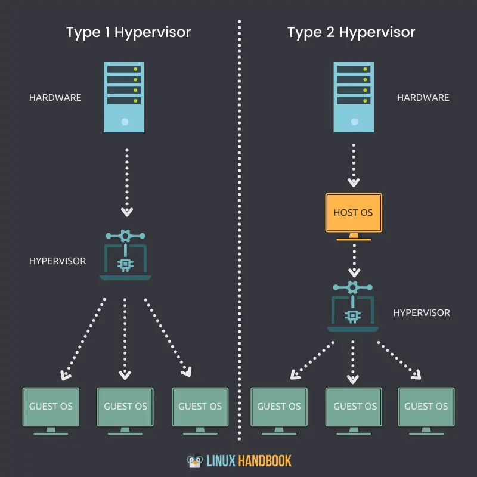
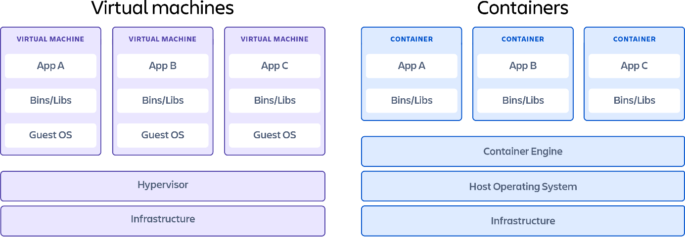

Unter virtuellen Maschinen versteht man
isolierte Computersysteme auf Software-Basis innerhalb eines physischen
Systems. Dabei werden die relevanten Hardwarekomponenten der Architektur
simuliert, um ein virtuelles System parallel zum eigentlichen
Hostbetriebssystem auszuführen. Dadurch müssen nicht mehrere, eigene
Systeme mit echter Hardware aufgebaut werden, sondern können zum
Beispiel einfach auf einem Computer mit hoher Rechenleistung
virtualisiert werden.\
\
Erstmals aufgekommen ist der Begriff Mitte der 1960er Jahre mit der
Einführung von IBMs „CP-40", welches sich später in „Unix"
weiterentwickelte und ein Mehrbenutzerbetriebssystem unterstützte. Im
Jahr 1972 veröffentlichte IBM die VM/370, welche erstmals virtuellen
Speicher unterstützte und wird somit von vielen als erste virtuelle
Maschine angesehen.\
Heute ist Virtualisierung ein Hauptbestandteil von IT-Infrastrukturen
jeglicher Art und wird in allen Bereichen der IT (zB Rechenzentren,
Cloud Computing, Softwareentwicklung, uvm.) für die unterschiedlichsten
Zwecke benutzt (zB Bereitstellung von (alten) Diensten, Testumgebungen,
Systeme in der Infrastruktur, uvm.). Diese können sowohl selbstständig
beschaffen und aufgebaut werden, oder mit individuellen Konfigurationen
durch Dienstleister wie zum Beispiel Microsoft Azure, AWS oder Google
Cloud bereitgestellt werden.\
\
Ermöglicht wird die Virtualisierung durch die Software „Hypervisor",
welche die Hardwareresourcen des Hosts als Pool betrachtet und zur
Bereitstellung für VMs isolieren kann. Davon gibt es zwei Typen:\
\
- Typ 1 -- Hardware-basiert: Virtualisierung findet direkt auf der
Hardware statt & kann durch zB MS Hyper-V oder KVM benutzt werden.\
- Typ 2 -- Host-basiert: Virtualisierung findet durch das
Hostbetriebssystem statt, welches die benötigten Hardwareresourcen
isoliert & kann durch zB Vmware Workstation oder Oracle VirtualBox
verwendet werden.\
\
{width="3.2395833333333335in"
height="3.2395833333333335in"}
\
Die Virtualisierung funktioniert, indem sie durch einen der beiden Typen
ausgeführt wird und „virtuelle Hardware" erzeugt. Dadurch können ein
oder mehrere Betriebssysteme aufgesetzt werden, welche alle auf den
verfügbaren Hardwarepool zugreifen und durch Befehle bzw. Aktionen ihren
definierten Ressourcenanteil nutzen können.\
\
In der Praxis sind virtuelle Maschinen jedoch nicht immer praktikabel,
da hierbei Hardware komplett simuliert wird und je nach
Gast-Betriebssystem auch einen höheren Ressourcenverbrauch verursacht
und man einen entsprechenden Performanceverlust erwarten muss. Deswegen
spricht man im Zusammenhang mit Virtualisierung oft über Container, da
hierbei kein ganzes Betriebssystem virtualisiert wird, sondern nur
kleinere Anwendungen, wofür nur der Host-Kernel verwendet werden muss.
Dadurch können zB leichtgewichtige Docker Container für spezifische
Zwecke wie Microservices oder Cloud Native Anwendungen aufgesetzt und
genutzt werden.\
\
{width="6.3in"
height="2.178472222222222in"}\
\
\
Software für virtuelle Maschinen werden von vielen Herstellern für
mehrere Betriebssysteme zu verschiedenen Konditionen bereitgestellt:\
\
- MS Hyper-V Manager -- enthalten in der Windows Pro Lizenz od. Windows
Server\
- Vmware ESXi -- verfügbar zu hohen Lizenzkosten & durch
unterschiedliche Versionen anwendbar auf Windows, Linux, MacOS, \...\
- Oracle Virtualbox -- kostenlos & verfügbar auf Windows od. Linux\
- Proxmox -- open source & anwendbar durch KVM\
- uvm. zB Xen, QEMU, ..\
\
Zu den gängigsten Technologien und den dazugehörigen Protokollen im
Bezug auf Virtualisierung zählen unter anderem:\
\
- Netzwerk: VLAN, VXLAN od. SDN -\> um virtuelle Netzwerke zu erstellen,
durch die virtuelle Maschinen untereinander oder extern kommunizieren
können\
- Storage: iSCSI, NFS, \... -\> um Speicherzugriffe über Netzwerke zu
ermöglichen\
- Cloud-Technologien: Terraform, Cloud-Init, \... -\> IaC-Tools zur
automatisierten, vordefinierten Initialisierung und Bereitstellung von
virtuellen Maschinen\
- Verwaltung: zB Role Based Access Control -\> um Benutzerrechte zu
definieren und zu steuern

Quellen (22.05.2026)\
\
https://www.ibm.com/de-de/think/topics/virtual-machines\
https://de.wikipedia.org/wiki/Hypervisor\
https://www.nutanix.com/de/info/virtual-machine#howworks\
https://www.redhat.com/de/topics/virtualization/what-is-a-virtual-machine\
https://linuxhandbook.com/what-is-hypervisor/\
https://www.ionos.at/digitalguide/server/konfiguration/virtualisierungssoftware-im-vergleich/\
https://www.proxmox.com/en/products/proxmox-virtual-environment/overview\
https://www.atlassian.com/de/microservices/cloud-computing/containers-vs-vms\
LV-Material\
\
Bildquellen (22.05.2026)\
\
https://linuxhandbook.com/content/images/2021/11/type1-type2-hypervisor.png\
https://dam-cdn.atl.orangelogic.com/AssetLink/8rey324iqvflta48it3i685ys31yv4wj.png
